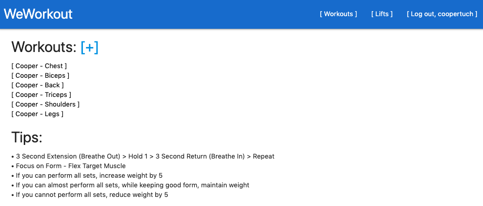
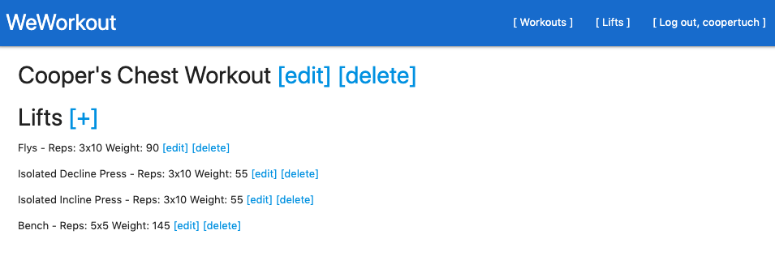
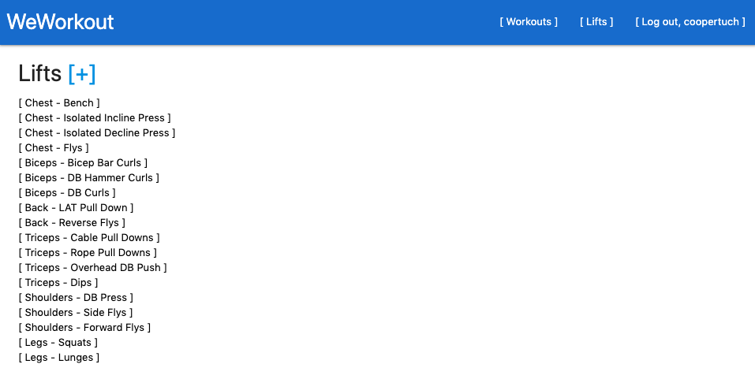
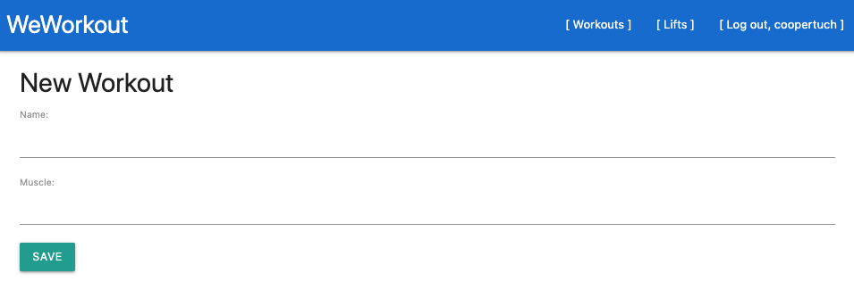
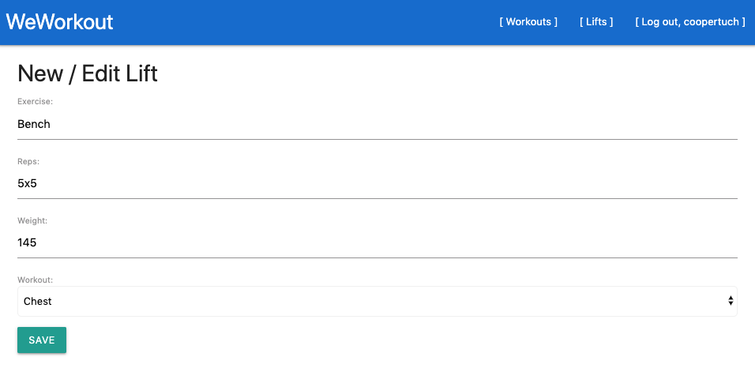

<h1>WeWorkout</h1>

## Description & Current Features:

WeWorkout is an open forum for finding workouts, adding your own workouts, and a database to track your weights, reps, sets, and progression. On the Home/Workout page, workouts are listed with the user's name and muscle group, followed by form, breathing, and progression tips; users can add workouts from this page using the + sign. Clicking into a workout will then display all lifts associated with that user's muscle group, with the exercise, desired reps, and weight; users can add lifts from this page using the + sign, in addition to being able to edit and delete both the workout and lift info from this page. The Lifts page will display all lifts, where users can click on lifts to view, edit, or delete. To add, edit, or delete workouts and lifts, users must sign up and be logged in; users do not need to be logged in to just view workouts and lifts.

## User Stories:

This application is made for both new and experienced lifters alike! As a newcomer, view full workouts and lifts from a variety of other users, alongside tips for form, breathing, and progression, important factors that are often overlooked in weightlifting. If you've already mastered form and a variety of lifts, the next step is tracking. WeWorkout provides a neat platform to store your weights, reps, and sets, information that is vital to monitor progression. As a whole, WeWorkout is a simple guide and log catered to anyone who wants to lift weights!

## Planning & Examples:

## Features in Progress

Features in progress include adding the ability for users to customize their feed, filter workouts by user and workout type, and filter all lifts by workout type. Further, we would like to track the changes in data and present progression in the forms of graphs for users on their pages.

## Technologies Used

- HTML
- CSS
- JavaScript
- Python
- Django
- PostgreSQL
- Materialize
- Heroku
- GitHub

## Installation Instructions

Visit WeWorkout at https://we-work-out.herokuapp.com/
